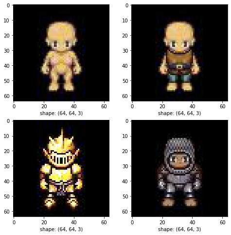
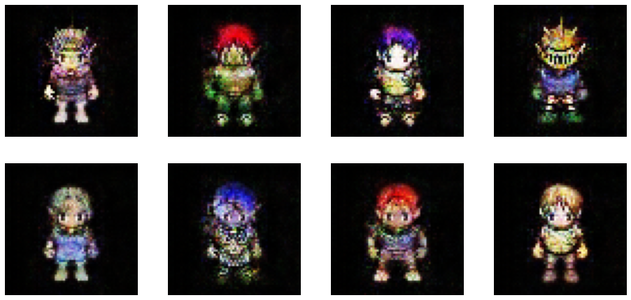

# pixeldcgan
Implementation of dcgan in tensorflow 2 for pixel art generation

Dataset: https://github.com/jrconway3/Universal-LPC-spritesheet extracted by: https://www.kaggle.com/calmness/retro-pixel-characters-generator?select=data

# Example of training data

# Sample output

